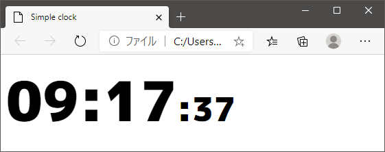
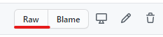

# SimpleClock
Webブラウザで動作するシンプルな時計です.

解説動画

## ダウンロード
1. ファイルの一覧から simple-clock.html を開く.
2. Rawボタンを右クリックして[名前を付けてリンク先を保存]

## カスタマイズ
ダウンロードした simple-clock.html をメモ帳などで開きます.

記載のコメントに従って値を調整してください.

### カスタマイズ可能な項目
- 背景色： 標準では透明です.
- 文字装飾
  - フォントの種類： フォント名は完全に正しく記入しないと動作しません.
  - フォントサイズ： ピクセルで指定します.
  - 文字の色： 16進数 RGBで指定します.
  - アウトライン： 標準では非表示です. 表示したい場合は前後のコメントアウトを外してください.　
- 時、分
  - フォントサイズ： 文字装飾のフォントサイズに対する割合.
- 秒
  - フォントサイズ： 文字装飾のフォントサイズに対する割合.

## OBS への取り込み
OBSのソースにブラウザを追加します. 設定でローカルファイルのチェックを入れ simple-clock.html を指定します.

### カスタムCSS
simple-clock.html 内のまでの間をコピーして、OBSのカスタムCSSとして指定すると、OBS側で表示をカスタマイズできます.
複数のシーンで異なるスタイルを設定したい場合はこの方法が便利です.

## ライセンス
### 要約
MIT License での配布なので利用制限、動作損害保証ともに一切ありません。
### 嬉しい
宣伝やRTをしてもらえると嬉しいです ⸜(*╹꒳╹* )⸝
https://twitter.com/yuki_natsuno_vt/status/1286504301120991232
